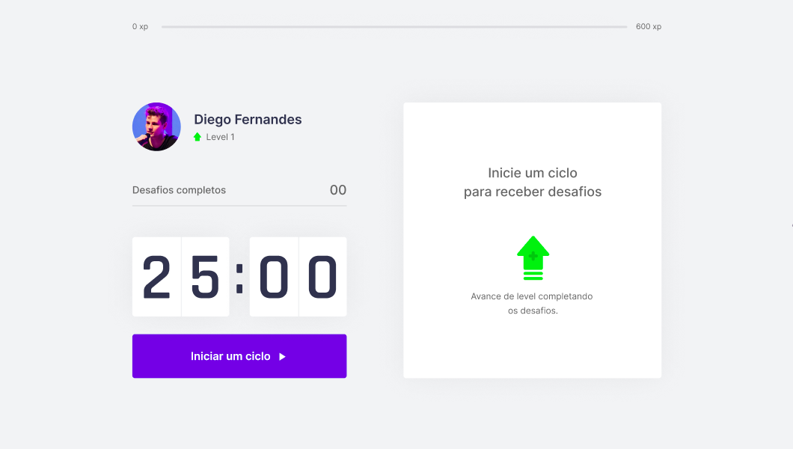
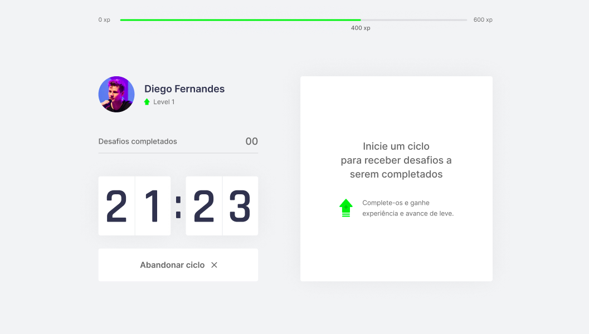
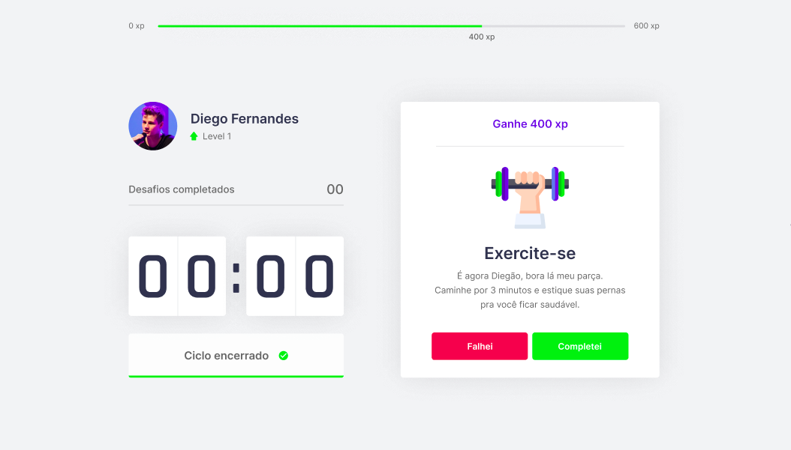
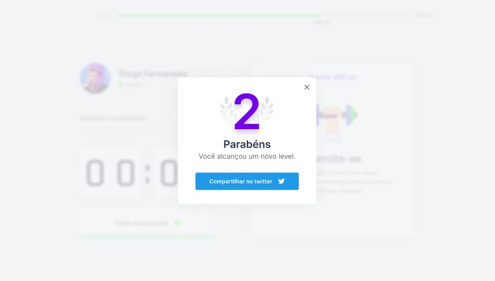

    
     
    <h1><strong>Movit</strong><h1>

   

   

   

   

   

   

---

# :pushpin: Table of Contents

- [About](#information_source-about)
- [Features](#rocket-features)
- [Technologies](#star-technologies)
- [Installation](#construction_worker-installation)
- [Getting Started](#runner-getting-started)
- [FAQ](#postbox-faq)
- [License](#closed_book-license)

 

# :information_source: About

This idea for the project came from the [Rocketseat](https://rocketseat.com.br/) people, in the first NLW (Next Level Week) of 2021.
The goal of this project is to put in moviment someone that works for a long period in front of a computer.
Movit uses the gamification conecpt and with it you can set a time to remember you to exercise, like the Pomodoro technique. If you done the exercise, your XP level will be increasing, and can share it with your friends.

# :rocket: Features

<!-- - #### Home Landing Page.
- #### A list of created Orphanages pinned in a map
- #### Creating new orphanages
- #### View specific orphanage
- #### Upload Photos -->

# :star: Technologies

| Frontend                                                  |
| --------------------------------------------------------- |
| [React](https://reactjs.org/)                             |
| [React Hooks](https://reactjs.org/)                       |
| [Context API](https://reactjs.org/)                       |
| [NextJS](https://nextjs.org/)                             |
| [styled-components](https://styled-components.com/)       |
| [react-icons](https://react-icons.github.io/react-icons/) |
| [axios](https://github.com/axios/axios)                   |
|                                                           |
|                                                           |

# :construction_worker: Installation

**You need to install [Node.js](https://nodejs.org/en/download/) and [Yarn](https://yarnpkg.com/) first, then in order to clone the project via HTTPS, run this command:**

`git clone https://github.com/jonatasoc/nlw_movit.git`

SSH URLs provide access to a Git repository via SSH, a secure protocol. If you have a SSH key registered in your Github account, clone the project using this command:

`git@github.com:jonatasoc/nlw_movit.git`

**Install dependencies**

`yarn`

# :runner: Getting Started

After that, run the following command in order to start the application in a development environment:

`yarn start`

# :closed_book: License

Released in 2021
This project is under the MIT license
